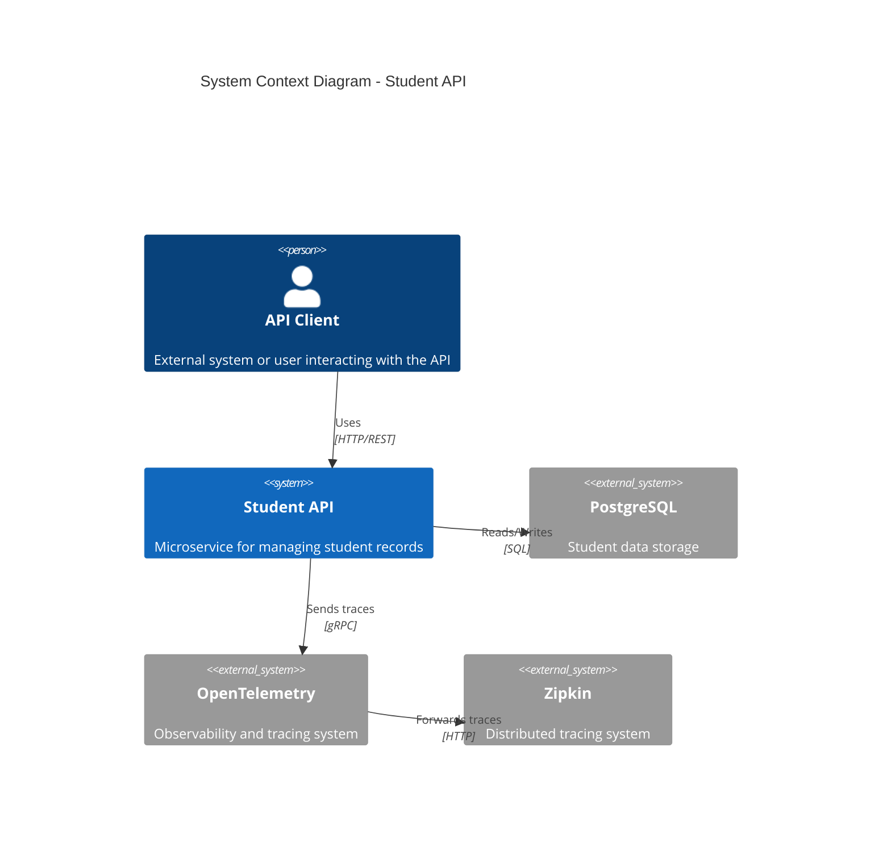
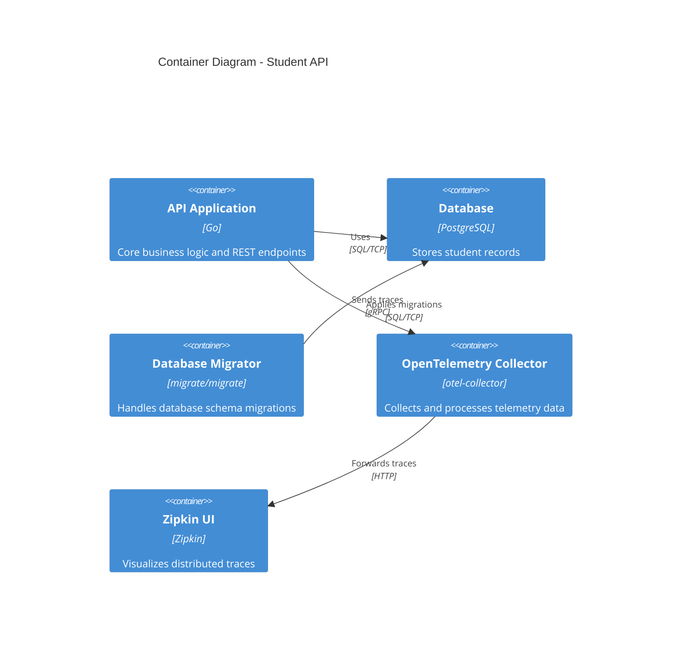
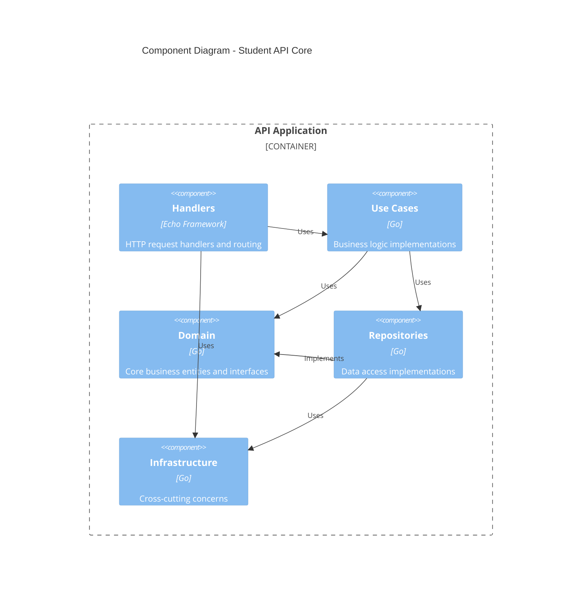

# Student API - C4 Model Architecture Documentation

## Table of Contents
1. [System Context](#system-context)
2. [Container View](#container-view)
3. [Component View](#component-view)
4. [Code Level](#code-level)
5. [Interaction Patterns](#interaction-patterns)
6. [Technical Details](#technical-details)

## System Context

The Student API is a microservice designed to manage student records with a focus on implementing RESTful best practices. It operates within a larger educational system context.



## Container View

The system is containerized using Docker and consists of several interconnected services.



## Component View

The application follows Clean Architecture principles with clear separation of concerns across different layers.



## Code Level

The system implements several key design patterns and architectural principles:

1. **Domain Layer**
   - Entities (e.g., Student)
   - Repository interfaces
   - Use case interfaces
   - DTOs for data transfer

2. **Use Cases Layer**
   - Implements business logic
   - Follows Decorator pattern for validation chains
   - Handles CRUD operations
   - Manages pagination and search

3. **Adapters Layer**
   - HTTP handlers using Echo framework
   - Repository implementations
   - Request/Response mapping

4. **Infrastructure Layer**
   - Database connectivity
   - Logging (Zap)
   - Tracing (OpenTelemetry)
   - Configuration management
   - Dependency injection (Uber FX)

## Interaction Patterns

The system follows several key patterns for request handling:

1. **Request Flow**
   ```mermaid
   sequenceDiagram
       participant Client
       participant Handler
       participant UseCase
       participant Repository
       participant Database

       Client->>Handler: HTTP Request
       Handler->>Handler: Validate Request
       Handler->>UseCase: Execute Operation
       UseCase->>Repository: Data Operation
       Repository->>Database: SQL Query
       Database-->>Repository: Result
       Repository-->>UseCase: Domain Object
       UseCase-->>Handler: Result DTO
       Handler-->>Client: HTTP Response
   ```

2. **Error Handling**
   - Consistent error responses
   - Domain-specific error types
   - Proper HTTP status codes
   - Detailed logging and tracing

## Technical Details

1. **API Features**
   - Healthcheck endpoint
   - CRUD operations for students
   - Pagination support
   - Search functionality
   - Multi-tenant support
   - Request tracing
   - Graceful shutdown

2. **Infrastructure Components**
   - Go 1.23
   - PostgreSQL 16.4
   - OpenTelemetry Collector
   - Zipkin
   - Echo Web Framework
   - Zap Logger
   - Uber FX for DI

3. **Development Tools**
   - Pre-commit hooks
   - GolangCI-Lint
   - Swagger/OpenAPI documentation
   - Comprehensive test suite
   - Docker and Docker Compose
   - Make for build automation

4. **Security Considerations**
   - Tenant isolation
   - Request correlation IDs
   - Input validation
   - Proper error handling
   - Database connection pooling

5. **Monitoring and Observability**
   - Distributed tracing
   - Structured logging
   - Health checks
   - Database connectivity monitoring

The architecture emphasizes:
- Clean separation of concerns
- Dependency inversion
- Interface-based design
- Testability
- Observability
- Scalability
- Maintainability